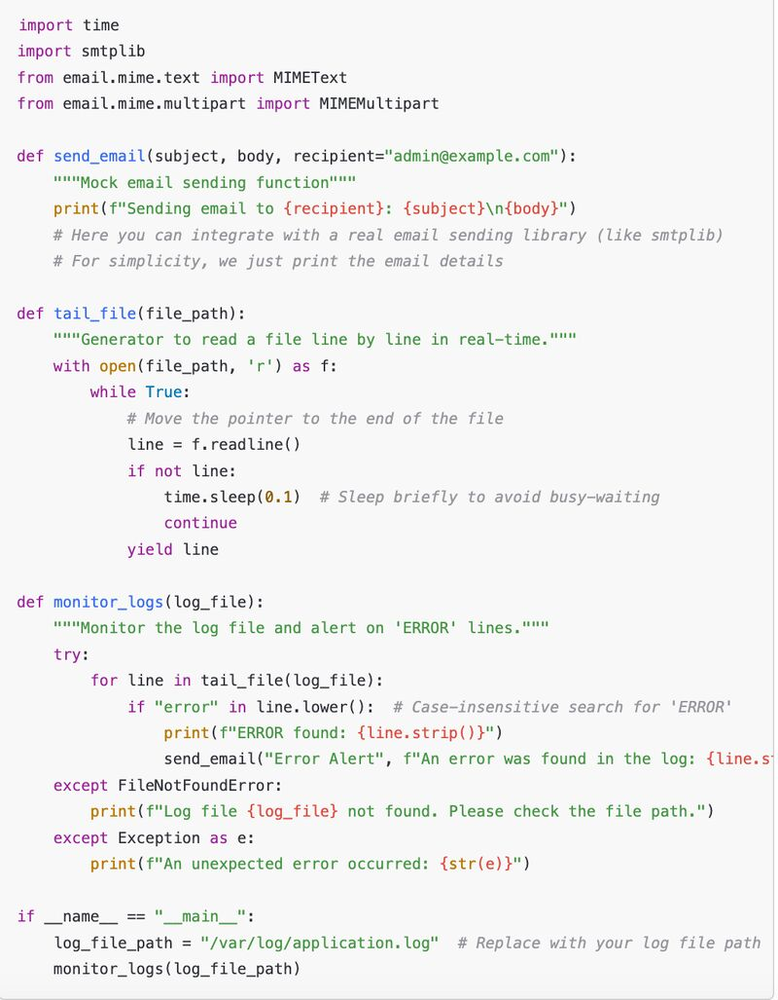

### Build a Python script for log file monitoring and alerting

## Problem Statement:

You are tasked with creating a Python script to monitor a log file in real time. The script should:

1) Continuously monitor a given log file (e.g., /var/log/application.log).

2) Search for any lines containing the word "ERROR" (case-insensitive).

3) Once an "ERROR" line is detected, the script should:
 Print the line to the console.
 Send an email alert (you can mock the email part for simplicity).

4) The script should keep running indefinitely and monitor the log file for new entries.

